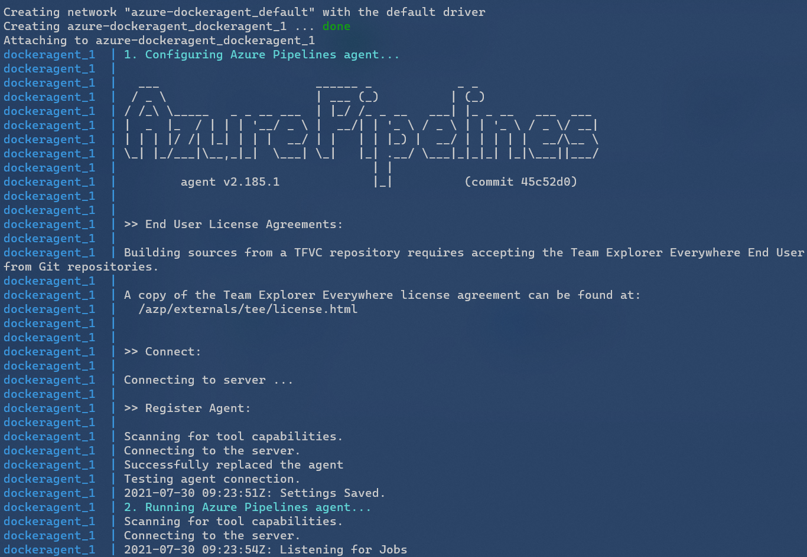

# azure-dockeragent


---

[📚 **Source**](https://docs.microsoft.com/en-us/azure/devops/pipelines/agents/docker)

### Build 🏗

```sh
d build -t dockeragent:latest linux
d run --rm `
    -e AZP_URL=$env:AZP_URL `
    -e AZP_TOKEN=$env:AZP_TOKEN `
    -e AZP_AGENT_NAME=mydockeragent `
    -e AZP_POOL=mydockerpool `
    -v /usr/local/bin/docker:/usr/bin/docker `
    -v /var/run/docker.sock:/var/run/docker.sock `
    dockeragent:latest
```

- AZP_URL = l'URL de l'organisation Azure DevOps
- AZP_TOKEN = un PAT

⚠ Si lancé en mode **Windows container**, ne pas oublier de revenir aux **Linux containers** après.
